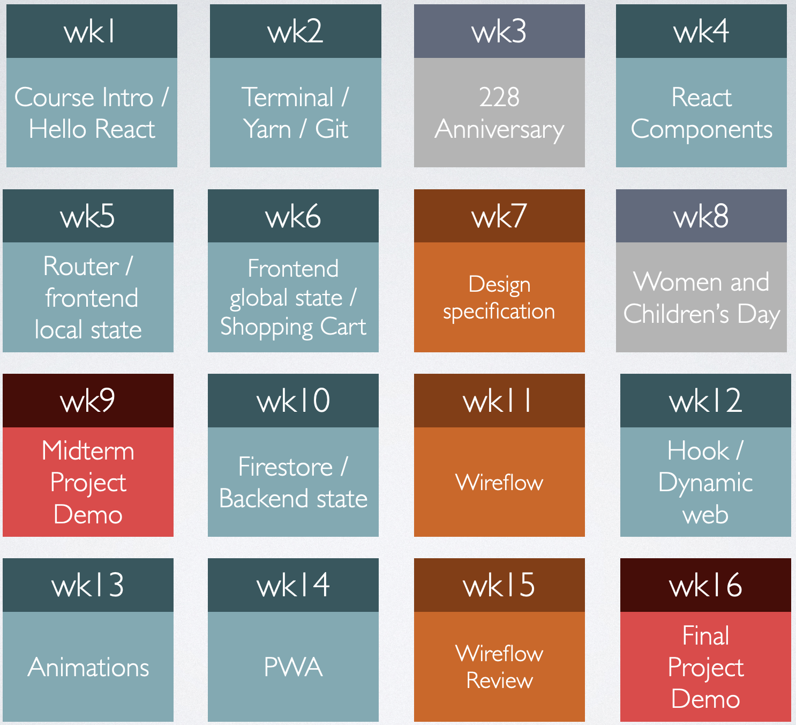

# NTUE React [投影片下載](https://drive.google.com/drive/folders/1ywqhSuS3Yjb0vbK3wgDrO21xoCdsMd8m?usp=sharing) 

## 課程大綱
> 現今的前端工程技術已經逐漸開始應用至不同平台與不同領域。為了讓學生能確實掌握前端工程的技術層面，以便能在不同領域進行開發。本門課在學生已經具有基本的前端UI/UX與技術的基礎上，引導學生在前端工程技術與設計持續精進，並且將所學之技術應用至不同的應用平台實現更符合業界需求之產品

## 教學進度

