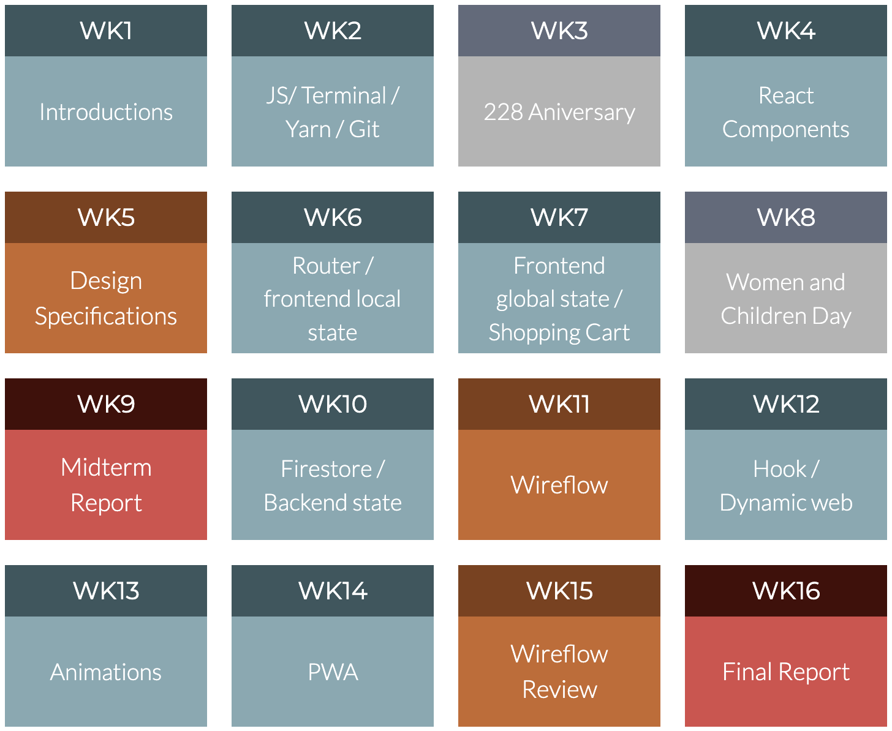

# NTUE React [投影片下載](https://drive.google.com/drive/folders/1ywqhSuS3Yjb0vbK3wgDrO21xoCdsMd8m?usp=sharing) 

## 課程大綱
> 本門課程基於同學已經具有前端工程設計基礎的HTML/CSS/JS 程式開發與UI / UX 設計能力而設計。課程目標在於建立同學運用SPA框架設計前端頁面，與運用後台資源進行服務設計的能力
>
> 本課程包含前端框架React相關的元件設計，元件庫運用，進階CSS設計與資料設計，並且結合Wireflow進行服務設計。

---

## 教學進度

---

### 課程架構

